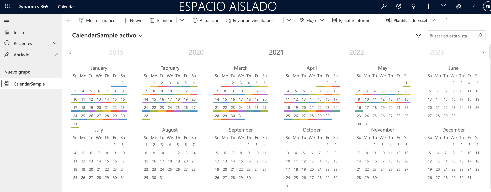

# YearCalendarControl #

This control is based on [React Year Calendar Project](https://github.com/year-calendar/rc-year-calendar) and [Fluent UI FrameWork](https://developer.microsoft.com/es-es/fluentui#/).
This control works in Model Drive Apps in Microsoft DataVerse. 

You must define the name of fields of the Table in Microsoft DataVerse in Index.ts between the lines 18-21.

## Releases ##

[V1.0.0.0](https://github.com/eromerof/YearCalendarControl/releases/tag/1.0.0.0)

## How To Configure ##

[Configure Year Calendar Control](https://dynamicsbox.es/wordpress/configure-year-calendar-control/)
